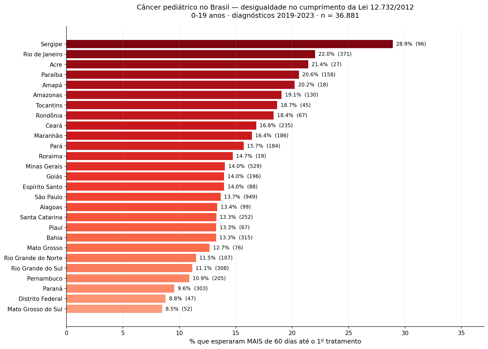
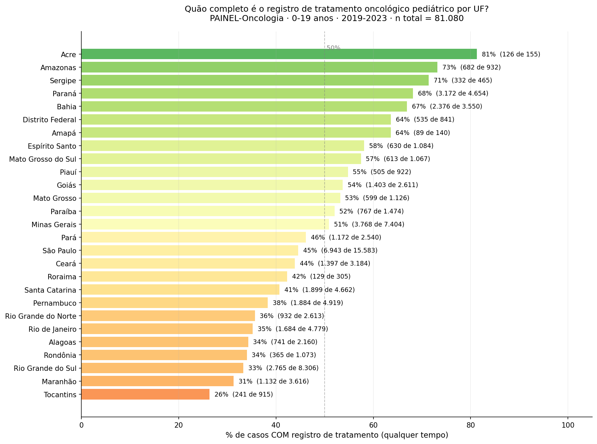
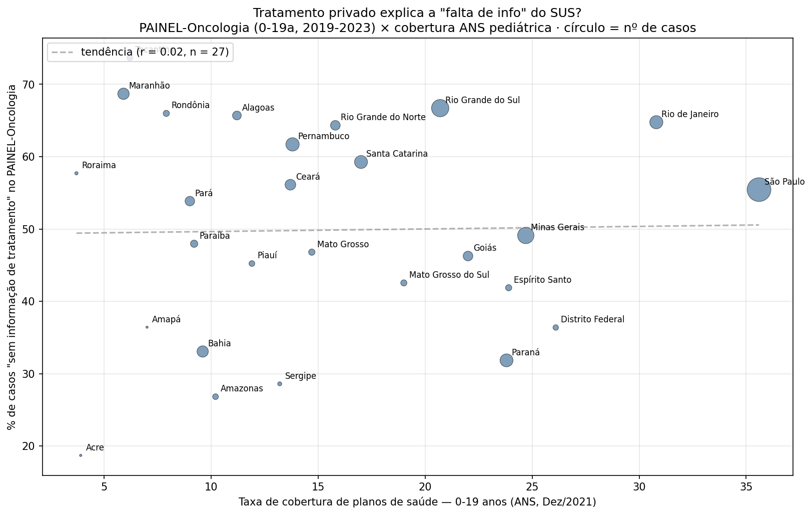

# Quanto tempo uma criança com câncer espera no Brasil?

### E o que o SUS sabe — ou não sabe — sobre o tratamento de 81 mil crianças e adolescentes brasileiros.

*Por Victor Gonçalves Souto · Consultoria Souto · Abril de 2026*

---

Em março de 1999, eu tinha seis meses. Estava com pneumonia. O raio-x do tórax pegou também o abdômen e mostrou uma massa do tamanho de uma laranja — palavra do meu avô, que viu a chapa antes do médico explicar o que era. Era um neuroblastoma.

Cirurgia de remoção do tumor, quimioterapia no Instituto da Criança do Hospital das Clínicas em São Paulo, quatro anos de tratamento ativo, e depois mais quatorze anos de acompanhamento anual no ICESP até a alta médica aos dezoito. Estou escrevendo isso aos 27 anos.

Vinte e sete anos depois, fui olhar nos dados públicos do SUS o que aconteceu com as outras 81.080 crianças e adolescentes diagnosticadas com câncer no Brasil entre 2019 e 2023. Encontrei três coisas que me incomodaram, e uma delas — a maior — não está em nenhum dos relatórios oficiais que encontrei.

---

## Por que isso importa

Câncer infantil não é câncer de adulto em corpo pequeno. É outra doença.

Em adultos, a maioria dos cânceres se desenvolve ao longo de décadas, ligada a tabaco, álcool, alimentação, exposição ambiental. Crescem devagar e podem ser detectados em exames de rotina — mamografia, papanicolau, colonoscopia. Em crianças, é diferente: as causas são em grande parte desconhecidas, o tumor cresce rápido, e não existe rastreamento de rotina. O câncer aparece sem aviso, muitas vezes descoberto por acaso — como o meu, num raio-x feito por causa de uma pneumonia.

A boa notícia é que crianças respondem melhor ao tratamento do que adultos. O INCA, instituto que coordena o controle do câncer no Brasil, estima que cerca de 80% das crianças e adolescentes diagnosticados cedo e tratados em centros especializados podem ser curados. A má notícia é que esse "cedo" tem prazo legal.

Em 2012, o Brasil aprovou a Lei 12.732, conhecida como Lei dos 60 Dias. Ela determina que toda pessoa diagnosticada com câncer no SUS — adulto ou criança — tem direito a começar o tratamento em até 60 dias depois da confirmação do diagnóstico. O prazo vale para qualquer tratamento: cirurgia, quimioterapia, radioterapia.

A lei existe porque o tempo importa. Em câncer de criança, ele importa de forma cruel: cada semana de atraso pode deixar o tumor avançar de estágio. E o estágio no início do tratamento é o que mais determina a chance de cura. Diagnosticada cedo e tratada rápido, uma criança com leucemia tem mais de 90% de chance de cura no Brasil. Diagnosticada tarde ou tratada com atraso, essa chance cai muito.

A pergunta deste texto é simples: o Brasil cumpre essa lei?

Os dados públicos do próprio SUS mostram que não. E mostram algo pior: para mais da metade das crianças, o sistema nem consegue dizer.

---

## Quem espera mais

Entre 2019 e 2023, o SUS registrou 81.080 diagnósticos de câncer em crianças e adolescentes de até 19 anos. Desses 81.080, cerca de 36.881 têm registro do tempo até o início do tratamento. As outras 44.199 crianças são uma pergunta em aberto — uma das maiores deste trabalho — e voltarei a elas em detalhe na próxima seção.

Olhando para esses 36.881 casos com informação completa, 5.129 crianças esperaram mais de 60 dias entre o diagnóstico e o início do primeiro tratamento — descumprimento direto da Lei 12.732. Isso é uma a cada sete.

Mas a média nacional esconde o que está embaixo dela. Quando o número é quebrado por estado, a desigualdade aparece:

Sergipe lidera o atraso: quase três em cada dez crianças diagnosticadas com câncer no estado começaram o tratamento fora do prazo legal. Rio de Janeiro vem logo em seguida, com mais de uma em cada cinco. No outro extremo, Mato Grosso do Sul cumpre a lei em mais de 91% dos casos.

A primeira coisa que esse ranking quebra é o senso comum de que o problema é geográfico — Norte ruim, Sul bom. Não é assim. O Rio de Janeiro, sede do INCA e com vários hospitais de referência em oncologia, está no topo da lista de atrasos. O Pará, no Norte, está no meio. O Distrito Federal, com toda a infraestrutura de capital, está entre os melhores. Não há um padrão regional limpo.

O que existe são causas diferentes em estados diferentes. Sergipe é estado pequeno e não tem grande centro próprio de oncologia pediátrica — muitas crianças precisam ser transferidas para Bahia ou Pernambuco, e o tempo de referência come parte do prazo. Rio de Janeiro tem centros, mas tem fila — a regulação para o INCA, por exemplo, é gargalo conhecido entre quem trabalha no sistema. São duas falhas diferentes que produzem o mesmo resultado: uma criança esperando mais do que a lei diz que ela deveria.

E essa análise é só sobre as crianças que o sistema sabe que tratou. A pergunta maior — e mais incômoda — é o que aconteceu com as 44.199 que não aparecem nesses números.

---

## O que o SUS não sabe sobre si mesmo

Lembra das 44.199 crianças que ficaram de fora da análise anterior? Elas estão no PAINEL-Oncologia. O sistema sabe que foram diagnosticadas com câncer entre 2019 e 2023. Sabe a idade, o município de residência, o tipo de tumor, a data do diagnóstico. O que o sistema não sabe é o que aconteceu depois.

Não há registro de tratamento para 54,5% dos casos de câncer pediátrico no Brasil entre 2019 e 2023. Mais da metade.

Esse número precisa de um momento.

Quando o Ministério da Saúde divulga estatísticas sobre o cumprimento da Lei dos 60 Dias, o cálculo é feito sobre os casos com informação completa — os 36.881 da seção anterior, não sobre os 81.080. É correto fazer assim do ponto de vista estatístico, mas a comunicação pública omite o tamanho do furo. Quando se lê "74% das crianças foram tratadas no prazo legal" em algum relatório oficial, é preciso adicionar mentalmente: "entre as crianças sobre as quais o sistema sabe alguma coisa".

E o furo varia muito de estado para estado:

Acre tem registro completo para 81% dos casos. Tocantins, para 26%. Entre os dois extremos, 55 pontos percentuais de diferença.

Há três explicações possíveis para uma criança aparecer no PAINEL com diagnóstico mas sem registro de tratamento, e os dados não permitem distinguir entre elas com certeza:

A primeira é subnotificação. O hospital tratou, mas o registro não foi feito de forma que o cruzamento entre os sistemas do SUS (SIA, SIH, SISCAN) consiga identificar. Falha de processo, não de cuidado. A criança foi atendida; o dado se perdeu.

A segunda é tratamento fora do SUS. A família tinha plano de saúde, ou conseguiu recursos, e a criança foi tratada em hospital privado. O diagnóstico apareceu no SUS porque foi feito num hospital público, mas o tratamento aconteceu em outro lugar.

A terceira é a mais grave. A criança foi diagnosticada e, por algum motivo, não chegou a iniciar o tratamento dentro do sistema. Pode ter falecido antes. Pode ter sido perdida na referência entre municípios. A família pode ter desistido. Sem cruzamento com o Sistema de Informação sobre Mortalidade (SIM) e outras fontes, não é possível saber quantas das 44.199 crianças se enquadram nesse cenário.

Distinguir entre essas três explicações é o próximo passo necessário deste trabalho. Mas mesmo sem essa distinção, o número em si já diz algo importante: o sistema brasileiro de informação em câncer pediátrico tem uma cratera no meio. A política pública é construída sobre as crianças que aparecem nos registros. A outra metade das crianças, a gente faz o que com elas?

---

## Não é o plano de saúde

A primeira reação de quase todo mundo a quem eu mostrei os números da seção anterior foi a mesma: "ah, mas isso deve ser porque essas crianças estão sendo tratadas no privado". Parece uma explicação razoável. Tem uma lógica: quem tem plano de saúde não precisa esperar a fila do SUS, então o tratamento aconteceria fora do radar do PAINEL-Oncologia.

A Agência Nacional de Saúde Suplementar (ANS) publica dados abertos sobre quantos brasileiros têm plano de saúde, quebrados por estado e por faixa etária. Peguei a taxa de cobertura de planos de saúde para a população de 0 a 19 anos em dezembro de 2021 — meio do nosso período de análise — e cruzei com a porcentagem de "sem informação" do PAINEL.

Se a hipótese do tratamento privado fosse verdadeira, os estados com mais cobertura de plano deveriam ter mais "sem informação" no SUS, porque as crianças teriam sumido para a rede privada. O gráfico abaixo testa essa hipótese:

A correlação entre cobertura privada e falta de informação no SUS é de 0,02. Estatisticamente, é zero. Não há relação.

Olha os casos extremos:

- **Maranhão** tem 5,9% de cobertura privada (baixíssima), e 69% de "sem informação" no PAINEL.
- **São Paulo** tem 35,6% de cobertura privada (a maior do país), e 55% de "sem informação" no PAINEL.
- **Acre** tem 3,9% de cobertura privada (a menor do país), e apenas 19% de "sem informação" no PAINEL.

Se o plano de saúde explicasse o buraco, o Maranhão — onde quase ninguém tem plano — deveria ter os dados mais completos do país. Tem o segundo pior. O Acre, na mesma lógica, também deveria ter dados ruins. Tem os melhores.

A hipótese mais confortável — a que nos permitiria dizer "ah, essas crianças estão bem, só foram tratadas em outro lugar" — não sobrevive aos dados. O que significa que a cratera de informação no PAINEL-Oncologia é, em grande medida, um problema interno ao SUS. Pode ser subnotificação. Pode ser criança perdida no sistema. Pode ser óbito antes do tratamento. O que não pode ser é fingir que está tudo bem porque "foi tratada no privado".

---

## O caso Acre

Se tem um estado que quebra todas as hipóteses fáceis deste texto, é o Acre.

É o estado com menor cobertura de planos de saúde do Brasil (3,9%). É um dos estados mais distantes dos grandes centros de referência em oncologia pediátrica do país. Tem uma das menores populações absolutas do país. Pela lógica intuitiva, o Acre deveria ter os piores indicadores de tratamento oncológico do Brasil.

Tem alguns dos melhores.

81% dos casos de câncer pediátrico registrados no Acre entre 2019 e 2023 têm informação completa sobre o tratamento. Em contraste, Sergipe — que tem mais que o triplo da cobertura privada do Acre e está muito mais próximo de grandes centros — registra 71%. Tocantins, também amazônico e com estrutura semelhante à do Acre, registra 26%.

O Acre tem apenas 155 casos de câncer pediátrico no período, contra 915 do Tocantins. Com volume menor, é mais fácil manter controle rigoroso do fluxo de informação. Mas mesmo contando esse fator, a diferença é grande demais para ser explicada só por tamanho.

Algo, em algum hospital, em alguma equipe, em algum fluxo de registro no Acre funciona de um jeito que em outros lugares não funciona. Descobrir o que é, e se é replicável, é um projeto em si.

O ponto para o leitor deste texto é outro: completude de registro de oncologia pediátrica não é destino estrutural. Não é consequência inevitável da pobreza, da distância, da falta de recursos. É decisão organizacional. É escolha de processo. Se o Acre consegue, todos podem.

---

## Limitações e próximos passos

Este trabalho é uma primeira camada. Há coisas que os dados usados não conseguem responder, e é importante deixar isso claro.

**O que não foi feito e está planejado.**

A análise das 44.199 crianças "sem informação" precisa ser aprofundada. O cruzamento com o Sistema de Informação sobre Mortalidade (SIM) permitiria saber quantas dessas crianças faleceram sem registro de tratamento iniciado — o cenário mais grave das três hipóteses apresentadas. Esse cruzamento exige acesso aos microdados nominais do SUS, que são protegidos pela LGPD e dependem de aprovação em Comitê de Ética em Pesquisa, normalmente através de uma instituição acadêmica. É um caminho longo, mas necessário, e está marcado para uma fase futura deste trabalho.

O cruzamento com o Cadastro Nacional de Estabelecimentos de Saúde (CNES) permitiria testar diretamente a hipótese da distância: será que estados cujas crianças precisam se deslocar mais para encontrar um centro especializado (UNACON ou CACON habilitado em oncologia pediátrica) realmente apresentam mais atraso? Essa análise está planejada para a próxima versão deste trabalho, com publicação prevista para as próximas semanas.

Intervalos de confiança não foram reportados nas porcentagens apresentadas por estado. Em estados com poucos casos (Acre, Amapá, Roraima), as estimativas têm margem de erro maior do que a diferença entre eles e seus vizinhos no ranking. Leia essas posições com cuidado.

**O que os dados usados não permitem saber.**

A Lei 12.732 permite atrasos clinicamente justificados (necessidade de estadiamento completo, preparo clínico, tratamento de comorbidades). Os dados do PAINEL-Oncologia não registram o motivo do atraso. Por isso, "descumprimento da lei" neste texto é sempre uma leitura conservadora: assume que todo atraso acima de 60 dias é violação, quando parte dele pode ser adequado clinicamente. O número real de violações da Lei é menor do que 5.129. Não sei quanto menor.

Também não é possível, com esses dados, distinguir se a criança que "tratou com atraso" teve pior desfecho do que a que tratou no prazo. A literatura médica sugere fortemente que sim, mas comprovar isso com os dados brasileiros específicos exigiria análise de sobrevida por coorte — outro projeto.

**O que é certo apesar das limitações.**

A desigualdade regional no cumprimento da Lei 12.732 existe e é mensurável. A cratera de informação no PAINEL-Oncologia pediátrico existe e é gigante. A hipótese do tratamento privado como explicação dessa cratera não se sustenta nos dados. Estes três achados não dependem de nenhuma das análises que ainda precisam ser feitas.

---

## O que fazer com isso

Diferentes leitores podem fazer coisas diferentes com a informação deste texto. Aqui vai uma lista curta:

**Se você é mãe, pai ou responsável por uma criança em investigação ou tratamento de câncer**, a Lei 12.732/2012 é sua. Documente as datas: quando o diagnóstico foi confirmado (data do laudo patológico) e quando o primeiro tratamento começou. Se a diferença passar de 60 dias sem justificativa clínica registrada, isso é descumprimento de direito. As ouvidorias do SUS, a Defensoria Pública e o Ministério Público Estadual podem ser acionados. Organizações como o GRAACC, o Instituto Ronald McDonald e a ABRALE também orientam famílias.

**Se você trabalha em um hospital que atende oncologia pediátrica**, o registro importa. Um caso sem informação de tratamento no PAINEL não é um caso "invisível" por acaso — é um caso que a política pública vai usar para decidir onde investir. Caso registrado completamente é caso que conta.

**Se você é gestor municipal ou estadual de saúde**, a completude do seu estado no PAINEL-Oncologia é um indicador gerenciável. O Acre provou isso. Vale olhar como está o seu.

**Se você é jornalista ou pesquisador**, os dados usados neste texto são 100% públicos. Todo o código da análise está aberto no GitHub (link no fim). Repliquem para os estados, para os municípios, para outros tipos de câncer, para populações adultas. O método é o mesmo, o problema provavelmente também.

**Se você é só uma pessoa que leu até aqui**, compartilhe este texto com alguém que toma decisão. Gestor, deputado, vereador, médico, jornalista. A primeira barreira contra esse tipo de desigualdade é a invisibilidade. Quebrar essa barreira não exige especialização — exige só que mais gente saiba.

---

## Como reproduzir

Todas as análises deste texto foram feitas com dados públicos e código aberto.

**Fontes:**
- PAINEL-Oncologia (DATASUS / Ministério da Saúde) — tempo até o início do tratamento oncológico. Acessado via tabnet.datasus.gov.br.
- ANS TABNET (Agência Nacional de Saúde Suplementar) — taxa de cobertura de planos de saúde por UF e faixa etária. Acessado via www.ans.gov.br/anstabnet.
- Lei 12.732 de 22 de novembro de 2012.

**Código e dados:**
O repositório com todo o código Python, os arquivos CSV brutos e os gráficos gerados está disponível publicamente em: https://github.com/VictorGSoutoXP/Oconlogia---Brasil

Licença: código sob MIT, texto sob Creative Commons BY-SA 4.0. Use, adapte, replique, critique, melhore.

**Crítica e colaboração:**
Encontrou um erro? Tem uma análise adicional para sugerir? Trabalha com oncologia pediátrica e discorda de alguma conclusão? Escreva: victor@soutoconsultoria.com.br

Este texto será atualizado conforme novas análises forem feitas e conforme críticas legítimas forem incorporadas.

**Versão atual:** 1.0 — abril de 2026
